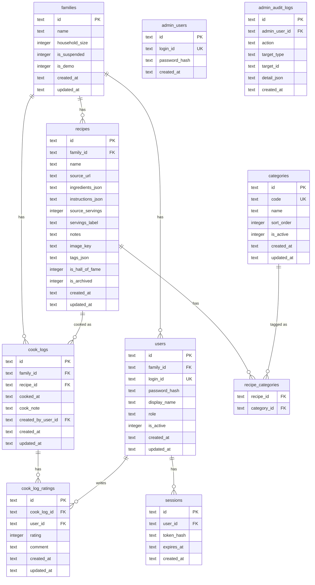

# 家庭料理ログアプリ 仕様書

| 項目 | 内容 |
|---|---|
| バージョン | 0.6.1 |
| 更新日 | 2026-07-30 |
| ステータス | **Phase 1 実装済み**（ローカル動作確認済み）。Phase 2 以降は未着手（カテゴリマスタは Phase 2 予定） |

---

## 1. プロダクト概要

### 1.1 コンセプト

> **気になるレシピの出典を残し、うちの版として保存・アレンジする。作ったら家族でレビューする。**

ベースは「**リンク保存集 + 家族レビュー**」。  
そのうえで調理者向けに、**レシピ本文・画像の保存と編集（自分アレンジ）**を厚くする。

公開レシピ百科でも、サイト横断スクレイパーでもない。  
家庭内で使う「うちのレシピ帳 + 作った記録 + 家族の声」。

### 1.2 誰が何を欲しいか

| 役割 | 欲しいこと |
|---|---|
| Owner（＝調理者） | レシピを手元に残す / サムネを残す / 自分用に編集・アレンジする / 作った回のメモ |
| 家族（Reviewer） | 作ったものへの★・コメント / 見返し / ランキング・殿堂 |

### 1.3 目的

| 目的 | 具体 |
|---|---|
| 出典を残す | URLを貼るだけ（参照・再訪用） |
| うちの版を持つ | コピペ → **AI整形** → 確認・微修正して構造化保存・編集 |
| 家の人数に合わせる | 調理者が設定した家族人数に応じて分量を自動換算表示 |
| 画像を残す | レシピの **サムネイル1枚** をユーザーがアップロード（サイト画像の勝手利用はしない） |
| 家族で評る | メンバーごとの★と一言 |
| 見返す | 一覧 / カレンダー / ランキング / 殿堂入り |

### 1.4 想定ユーザーと役割

ユーザーは **家族（Family）単位** で増える。  
データ（レシピ・ログ・設定）は家族ごとに分離する。

| ロール | 呼び名 | 主な仕事 |
|---|---|---|
| システム管理者 | Admin | プラットフォーム運用（日常不要だが運用画面としてポートフォリオ実装） |
| 親ユーザー（＝調理者） | Owner | Family 作成・構成・**調理のすべて**（レシピ/記録/AI/メモ）。Phase 2 で家族アカウント発行。**自分用に別 Cook アカウントは作らない** |
| 追加の調理者 | Cook | Phase 2 で Owner が発行する **追加メンバー用**。権限は調理系（Owner の管理権限は持たない） |
| 家族レビュー | Reviewer | Phase 2。★・コメント・閲覧。レシピ編集不可 |

**原則: Owner ＝ 最初の調理者（Cook 権限を内包）**

- DB の `role = 'owner'` は、調理操作（レシピ CRUD・AI・記録・定番メモ・サムネ・Groq キー設定・人数設定）ができる
- Phase 1 では家族内ユーザーは実質 **Owner のみ**（追加 Cook / Reviewer は未発行）
- `role = 'cook'` は「親以外にも調理させたいとき」の追加アカウント用ラベルであり、Owner と対等な別人格を最初から用意する意味ではない

#### アカウントの増え方

```
親ユーザーが簡易登録（id + password）
        ↓
家族（Family）が1つ作られる
親 = Owner = 調理者（1アカウントで完結）
        ↓
Phase 1: その Owner がログインしてレシピ・記録を使う
        ↓
Phase 2: 必要なら親が追加アカウントを発行
         （追加 Cook / Reviewer）
```

- **親ユーザーの新規登録:** 簡単な **ID + パスワード** で可。メール認証・電話認証は不要（個人開発レベル）
- **家族アカウント発行:** Owner のみ（Phase 2）。パスワードも同様に簡易でよい
- **パスキー:** あれば嬉しいが必須ではない。MVPは ID/パスワードで十分。後続でパスキー追加可
- **家族構成**（人数・誰がレビューするか）は Owner 側。Admin は家庭の中身（レシピ本文・レビュー）を編集しない
- Reviewer はレシピ編集不可（読取＋レビュー）

### 1.5 システム管理者（Admin）の位置づけ

家庭利用だけなら Admin はほぼ不要。  
ただしビジネスアプリでは「テナント横断の運用画面」が定番のため、**ポートフォリオとして次を実装する**。

| 領域 | 内容 | ねらい（見せたいこと） |
|---|---|---|
| 運用ダッシュボード | Family / User / Recipe / CookLog / Rating の件数、直近登録 | KPI・集計クエリ |
| テナント（Family）管理 | 一覧・詳細（人数・メンバー数・レシピ数など概要）、停止/再開 | マルチテナント運用 |
| ユーザー横断管理 | 検索、無効化、パスワード緊急リセット | サポート業務の定番 |
| 監査ログ | Admin 操作の記録（誰が・何を・いつ） | ガバナンス / 説明責任 |
| システムヘルス | D1 疎通・簡易ステータス表示 | 運用監視の入口 |

**やらない（境界）**

- レシピ本文・材料・手順・レビューの中身編集（家の領域）
- 家族人数の変更（親/調理者側）
- ユーザーへのなりすましログイン（個人開発では過剰・危険）
- 課金・プラン・請求（対象外）

### 1.6 非目標

- レシピサイトの自動スクレイピング / サイト別パーサー量産
- サイト画像のホットリンク常設・無断ミラー
- レシピの外部公開・再配布・ソーシャル投稿
- 献立自動生成・買い物リスト（初期対象外）
- メール認証・OAuth・複雑なIdP（初期対象外）

---

## 2. 技術スタック

| 層 | 技術 | 備考 |
|---|---|---|
| フロントエンド | Next.js（App Router） | `apps/web`。日本語のみ / モバイル優先 |
| バックエンド | Hono on Cloudflare Workers | `apps/api` |
| DB | Cloudflare D1（SQLite互換） | |
| ORM | Drizzle | スキーマは `apps/api` |
| 共有 | `@pf08/shared` | 分量換算・材料行パース等 |
| 画像 | Cloudflare R2 | レシピサムネイル（任意・1枚） |
| AI整形 | Groq API（デフォルト `llama-3.1-8b-instant`） | コピペ → 構造化JSON。キーは localStorage（§3.3） |
| デプロイ | Pages + Workers | 無料枠優先 |
| パッケージ管理 | pnpm workspaces | ルートで `pnpm dev` |

```
[Browser]
   │  Groq キーは localStorage（デモ Family も同じ）
   ▼
Next.js (UI) … 日本語のみ / モバイル優先
   │
   ▼
Hono (Workers)
   ├── D1 … Family / User / Recipe / CookLog / Rating / …
   └── R2 … レシピサムネイル
```

※ Groq キーはサーバーに永続保存しない。整形時だけクライアントから都度送る。

---

## 3. コア方針（データと入力）

### 3.1 出典URL

- 任意フィールド。メモ・再訪用
- **取得・スクレイピングは行わない**（MVP〜当面）
- UIに「出典を開く」リンクを出す

### 3.2 レシピ本文

- 調理者が **コピペ → AI整形 → 確認・微修正** した内容を、**自分のコピー**としてDB保存
- 既存レシピの編集（アレンジ）は **AIなしで直接編集可**
- 元サイトの最新版との同期はしない

### 3.3 AI整形（Phase 1 必須 / Groq）

雑にコピペしたテキストを、**Groq API**（実装デフォルトモデル: `llama-3.1-8b-instant`）で固定スキーマのJSONに整える。  
呼び出しは OpenAI 互換の Chat Completions（`response_format: json_object`）。

**位置づけ:** レシピ登録の本線。サイト自動取得はしないため、コピペ文を材料・手順に落とす手段として **AI整形は必須**。  
整形できないと構造化保存が実務上つらいので、**失敗時は手入力フォールバックせずエラー表示**する。

```json
{
  "name": "肉じゃが",
  "sourceServings": 2,
  "ingredients": ["じゃがいも 3個", "豚肉 200g"],
  "instructions": ["切る", "炒める", "煮る"],
  "notes": "次は砂糖控えめ"
}
```

※ AIが材料名と分量を交互行で出す場合がある。表示時はアプリ側で「材料名 / 使用量」にまとめてよい（§3.7）。

#### 登録フロー（本線）

```
出典URL（任意）
  → 本文をコピペ（材料・手順だけで十分。ページ全体のコピペは非推奨）
  → Groq で整形
  → 成功: プレビューで確認・微修正 → 保存（材料は1人前に正規化）
  → 失敗: エラー表示（再試行）。ゼロからの手入力保存は本線にしない
```

#### 整形ルール

- 出力スキーマは固定（サイト別プロンプトは作らない）
- レビュー・広告・フッター等のノイズは無視するようプロンプトで指示
- 不明項目は空（捏造しない）
- 整形 **成功後** のプレビューでは材料・手順・メモ等を微修正してから保存できる
- キー未設定 / APIエラー（429 レート制限含む）/ パース失敗 → **エラーメッセージを出し、保存フローは進まない**（再試行またはキー設定へ）
- AI出力の材料は **sourceServings 人分のまま** でよい。保存時にアプリ側で **1人前に正規化** する（§3.7）

#### APIキー管理

| 用途 | キーの置き場 | 説明 |
|---|---|---|
| 実運用 Family | 端末の **localStorage** | 調理者自身のキー。サーバーに永続保存しない |
| デモ Family | 端末の **localStorage**（実運用と同じ） | シードデモでも設定画面でキー登録が必要 |

| 項目 | 方針 |
|---|---|
| 入力UI | **Owner / 追加Cook**（調理権限があるユーザー）の設定でキーを登録・更新・削除（localStorage） |
| 呼び出し | 整形時にクライアントキーを都度サーバーへ渡す（永続保存しない） |
| 注意 | 共用PCでは localStorage にキーが残る点を設定画面に短く注記 |
| 発行 | https://console.groq.com/keys |

#### 学習・送信に関する注意（必須）

Groq に送ったテキストは、提供元側の仕組みで処理・学習等に使われる可能性がある。  
そのため **学習されてもよい内容だけ** を整形に使う前提とする。

**UI必須表記（整形画面・設定画面）**

- 整形を実行する前に、次の趣旨の注意を常時表示する（初回だけ消えるトーストでは不足）
- 送信ボタン付近にも短い注意を置く

表記例（実運用）:

> AI整形では入力したテキストを Groq API に送信します。  
> 学習・改善等に利用される可能性があります。  
> **個人情報・秘密にしたい内容・学習されて困る文章は入力しないでください。**  
> APIキーはこの端末のブラウザ（localStorage）にだけ保存され、当サービスのサーバーには保存しません。

- 可能なら「上記を理解して整形する」の確認チェックをつけてから実行可能にする
- README / 仕様でも同趣旨を明記する

### 3.4 画像（レシピサムネイルのみ）

| やってよい | やらない |
|---|---|
| レシピの **メインサムネイル 1枚** のアップロード | サイト画像URLの常時参照 |
| 差し替え・削除 | サイト画像の自動ダウンロード |
| | **作った記録（CookLog）への写真アップロード**（対象外） |
| | レシピへの複数枚ギャラリー（対象外） |

画像の本線は **ユーザーアップロード → R2保存（recipes.image_key 最大1本）**。  
**サムネなしでもレシピ保存可**（任意）。

### 3.5 メモの二層（定番メモ と その回の一言）

アレンジの残し方を分けて持つ。

| 場所 | フィールド | 誰が書く | いつ使うか |
|---|---|---|---|
| Recipe | `notes` | Owner / 追加Cook | **うちの版の定番メモ**（例:「いつも塩控えめ」） |
| CookLog | `cookNote` | Owner / 追加Cook（作った側） | **その回だけ**の記録（例:「今日は玉ねぎ多め」） |
| CookLogRating | `comment` | Reviewer 等 | 食べた側の感想（★とセット。Phase 2） |

方針:
- 「いつ・どうアレンジしたか」は **CookLog.cookNote** が本命（日付とセットで残る）
- レシピ本文を毎回書き換えなくても、ログに一言残せる
- 定番化したアレンジは、あとで Recipe の材料・手順や `notes` に反映してよい（手動）
- どちらも任意（空で保存可）

### 3.6 編集

- レシピの名前・材料・手順・定番メモ・サムネイル・出典URLはいつでも編集可
- CookLog の日付・調理者メモも編集可
- バージョン履歴はMVP対象外（上書きでよい）

### 3.7 家族人数と分量換算

管理画面（**Owner＝調理者**）で **家族の人数（何人前で作ることが多いか）** を登録する。  
DB上の材料は常に **1人前** に正規化して保存し、表示時に家族人数（例: 4人）を掛けて見せる。

#### 設定

| 項目 | 説明 |
|---|---|
| householdSize | 家族人数（整数、例: 4）。料理の「うちの標準人前」 |
| 場所 | **Owner** の家族構成・設定画面 |
| 保存先 | D1（アプリ設定）。メンバー名簿とは別概念 |

※ `User`（ログインして評価する家族）と、`householdSize`（分量換算用の人数）は分ける。  
　ログインしない幼児を人数だけ数えたい、などの差があり得るため。

#### レシピ側

| 項目 | 説明 |
|---|---|
| ingredients | **1人前** に正規化した材料リスト（DBの正） |
| sourceServings | 登録・編集時にユーザーが入力した「何人分の分量か」（正規化の分母。メタとして保持してよい） |

保存時（正規化）:

```
入力: sourceServings = 2、材料「豚肉 200g」
→ 各材料の数量 ÷ sourceServings
→ DB保存: 「豚肉 100g」（常に1人前）
```

表示時（クライアント計算）:

```
displayServings … レシピページ上の「何人前」表示用の数値（DBには保存しない）
初期値 = householdSize（家族設定）
各材料の数量（1人前） × displayServings  → 画面に表示
```

例: DBは1人前 `豚肉 100g`・家族設定4人 → 開いた直後は `豚肉 400g`  
ユーザーが人前入力を `2` に変えると → `豚肉 200g`（裏で再計算。DBは触らない）

#### UI（レシピ詳細・閲覧）

- **人前表記は数値 input**（例: `[ 4 ] 人前`）
- デフォルト値は **家族設定の `householdSize`**
- 材料は **テーブル表示**（列: **材料** / **使用量**）
  - 1行に「材料名 + 分量」がある場合は分割して表示
  - AI等が「材料名」「分量」を交互行で出している場合は1行にまとめる
  - `☆調味料` や `仕上げ用` など見出し行はセクション行として全幅表示してよい
- 使用量列は、その input の値（`displayServings`）で裏計算した結果を表示する
- input を変えるとその場で使用量が切り替わる（ページリロード不要）
- `displayServings` は表示用の一時状態。家族設定やレシピ本体は変更しない
- 1未満や不正値は弾く（整数・1以上。実装: `Math.max(1, floor(displayServings))`）
- 登録・編集フォームでは「いま入力している分量は何人分か」（`sourceServings`）を明示入力し、保存時に1人前へ正規化
- 編集画面では「いまの displayServings 人分の見た目」で直せるようにしてもよいが、保存時は再び1人前に戻す

#### 換算ルール（実装）

| 換算しやすい | 換算しにくい・そのまま |
|---|---|
| `300g` `2個` `大さじ1` `1/4本` `大さじ1と1/2` | `適量` `少々` `お好み` `ひとつまみ` |
| 使用量側の数値がはっきりしている行 | 手順文中の「10分煮る」などの時間（人数で変えない） |

方針:
- 数値＋単位が取れる行だけ機械換算（保存時の ÷N と表示時の ×displayServings の両方）
- **分数は整数より優先してマッチ**（`1/4` を `1` と誤認しない。誤認すると `4/4` のような表示になる）
- `Nと1/2` のような複合数量はまとめて換算（例: `大さじ1と1/2` ×4 → `大さじ6`）
- 取れない行は原文のまま（「適量」等）。人数で割らない・掛けない
- 端数は実用的に丸める（0.25 刻み優先、それ以外は小数第1位）
- 完璧な食品科学的換算は目指さない（家庭用の目安）
- （任意・後続）LLM に「この材料リストを N 人分に」と頼む高精度モードを足してもよいが、必須ではない

#### 保存ポリシー

- DBに保存するのは **常に1人前の材料**（登録・編集入力を `sourceServings` で割って正規化）
- レシピページの人前 input による換算結果は **表示専用**（DB・家族設定は変えない）
- 「うち人数分の見た目のまま正として上書き」したい場合も、内部では1人前に正規化してから保存する

---

## 4. ドメインモデル

```
Family（家族テナント）
  ├─ householdSize
  ├─ User[] … Owner（＝調理） / 追加Cook / Reviewer
  │
  ├─ Recipe[]（うちの版）
  │     ├─ Category[]（多対多・Phase 2。マスタはグローバル）
  │     └─ CookLog[]
  │           └─ Rating[]（誰が評価したか → User）
  └─ …
```

レシピ・ログはすべて `familyId` でスコープする（他家族から見えない）。

### 4.0 Family

| フィールド | 型 | 必須 | 説明 |
|---|---|---|---|
| id | string | ○ | PK |
| name | string? | | 表示名（「〇〇家」等。任意） |
| householdSize | number | ○ | 分量換算用の家族人数 |
| isSuspended | boolean | ○ | Admin によるテナント停止 |
| isDemo | boolean | ○ | ポートフォリオ用デモ Family（シード） |
| createdAt | datetime | ○ | |

### 4.0b User（家族内アカウント）

| フィールド | 型 | 必須 | 説明 |
|---|---|---|---|
| id | string | ○ | PK |
| familyId | string | ○ | FK → Family |
| loginId | string | ○ | ログインID（**全体でユニーク**） |
| passwordHash | string | ○ | パスワードはハッシュ保存。平文禁止 |
| displayName | string | ○ | 表示名（パパ、ママ等） |
| role | enum | ○ | `owner` / `cook` / `reviewer`。**`owner` は調理権限を内包**（Owner＝最初の調理者） |
| isActive | boolean | ○ | 無効化用 |
| createdAt | datetime | ○ | |

制約:
- 親登録時に Family + Owner User を同時作成（Phase 1 はこの1人で調理まで完結）
- 家族アカウント発行は **Owner のみ**（Phase 2）。追加 `cook` / `reviewer` を作る
- Admin（プラットフォーム）は Family に属さない別系統（シード1アカウントで可）

### 4.0c 認証方針（個人開発向け）

| 項目 | 方針 |
|---|---|
| Phase 1 から必須 | 未ログインでは業務画面に入れない（ビジネスアプリとして認証あり） |
| 親ユーザー登録 | ID + パスワード。**メール認証なし**。登録と同時に Family + Owner(Cook権限) 作成 |
| 家族アカウント | Phase 2。親が ID + パスワードを発行して渡す |
| パスワード要件 | 緩めで可（最低文字数程度）。過度な複雑さは求めない |
| パスキー | MVP対象外。後続で追加可 |
| セッション | Cookie または簡易トークン。家族スコープを必ず付与 |
| リセット | 親が子のパスワード再発行。親自身は覚えておく or Admin緊急対応 |
| デモ Family | シードで用意。README にログイン情報を記載。レシピ新規（AI）まで操作可 |

### 4.0d デモ Family（ポートフォリオ）

| 項目 | 方針 |
|---|---|
| 目的 | 閲覧者がログインして操作を試せる |
| シード | Family + Owner ユーザー + サンプルレシピ任意 |
| Groq | 実運用と同じく端末 **localStorage**（設定画面で登録） |
| 操作範囲 | レシピ新規作成（AI整形）・編集・作った記録まで可 |
| 注意 | デモデータはリセットされてよい前提。README に ID/パスワードを公開してよい。AIには閲覧者自身の Groq キーが必要 |

---

### 4.1 Recipe（うちの版レシピ）

| フィールド | 型 | 必須 | 説明 |
|---|---|---|---|
| id | string | ○ | PK |
| familyId | string | ○ | FK → Family |
| name | string | ○ | 料理名 |
| sourceUrl | string? | | 出典URL（参照のみ） |
| ingredients | JSON (string[]) | | 材料（**常に1人前**に正規化済み） |
| instructions | JSON (string[]) | | 手順 |
| sourceServings | number? | | 登録・編集時に入力した人数（正規化の分母の記録。任意） |
| servingsLabel | string? | | 表示用（「2〜3人分」など自由記述。任意） |
| notes | string? | | 定番メモ（うちの版の常備アレンジ） |
| imageKey | string? | | サムネイル（任意・最大1枚） |
| tags | JSON (string[]) | | 自由記述タグ（任意・補助）。**分類の本線は Category（§4.5）** |
| isHallOfFame | boolean | ○ | 殿堂入り（手動） |
| isArchived | boolean | ○ | アーカイブ（一覧非表示） |
| createdAt | datetime | ○ | |
| updatedAt | datetime | ○ | |

※ Phase 2 以降、レシピはカテゴリマスタと多対多で紐づく（§4.5）。`tags` はマスタにない自由ラベル用に残してよい。

### 4.2 CookLog（作った記録）

| フィールド | 型 | 必須 | 説明 |
|---|---|---|---|
| id | string | ○ | PK |
| familyId | string | ○ | FK → Family |
| recipeId | string | ○ | FK → Recipe |
| cookedAt | date | ○ | 作った日 |
| cookNote | string? | | その回の調理者メモ（任意。例: 今日は玉ねぎ多め） |
| createdByUserId | string? | | 記録した User（任意だが推奨） |
| createdAt | datetime | ○ | |
| updatedAt | datetime | ○ | |

※ CookLog への写真アップロードは対象外（カラムなし）。

### 4.3 CookLogRating

| フィールド | 型 | 必須 | 説明 |
|---|---|---|---|
| id | string | ○ | PK |
| cookLogId | string | ○ | FK |
| userId | string | ○ | FK → User（評価した家族アカウント） |
| rating | number? | | 1–5 |
| comment | string? | | |
| createdAt / updatedAt | datetime | ○ | |

制約: `(cookLogId, userId)` ユニーク。

### 4.4 Category（料理カテゴリマスタ）— **Phase 2 推奨**

自由記述の `tags` とは別に、**選択式のカテゴリマスタ**を持つ。  
一覧の絞り込み・見返し・（Phase 3 の）カテゴリ別ランキングの土台にする。

#### なぜ Phase 2 か

| 候補 | 判断 |
|---|---|
| Phase 1 | MVP では名前検索・記録で足りる。後付けしやすい |
| **Phase 2（推奨）** | 家族レビュー開始と同時に「探す」需要が増える。既存 F-09（タグ強化）の本線にできる。Admin 画面と同期待ちしやすい |
| Phase 3 | ランキング直前でもよいが、データが無いとカテゴリ別集計が空振りしやすい |

#### 方針

| 項目 | 内容 |
|---|---|
| スコープ | **グローバルマスタ**（全 Family 共通）。シードで初期投入 |
| レシピとの関係 | **多対多**（1レシピに複数カテゴリ可。0件も可） |
| 家族独自カテゴリ | Phase 2 では作らない（後続オプション）。まずは共通マスタで揃える |
| 既存 `tags` | 残す。マスタにない自由ラベル用。分類の本線は Category |
| 管理 | Admin がマスタ CRUD（名称・並び・有効/無効）。家庭ユーザーは選択のみ |

#### Category

| フィールド | 型 | 必須 | 説明 |
|---|---|---|---|
| id | string | ○ | PK |
| code | string | ○ | 機械用コード（全体ユニーク。例: `rice`, `noodle`） |
| name | string | ○ | 表示名（例: ご飯もの） |
| sortOrder | number | ○ | 一覧の並び |
| isActive | boolean | ○ | 無効化すると新規割当不可（既存紐づけは残してよい） |
| createdAt / updatedAt | datetime | ○ | |

#### RecipeCategory（中間）

| フィールド | 型 | 必須 | 説明 |
|---|---|---|---|
| recipeId | string | ○ | FK → Recipe |
| categoryId | string | ○ | FK → Category |

制約: `(recipeId, categoryId)` ユニーク。  
整合性: `recipe.familyId` スコープでのみ操作（他家族のレシピには付けられない）。

#### シード例（初期案・実装時に調整可）

`ご飯もの` / `麺` / `汁物・スープ` / `肉料理` / `魚料理` / `野菜・サラダ` / `卵料理` / `揚げ物` / `炒め物` / `煮物` / `お菓子・デザート` / `その他`

#### （参考）旧概念の整理

- 旧 `Member` → `User` に統合済み
- 旧 `AppSettings.householdSize` → `Family.householdSize` に統合済み

---

## 4.5 ロールと権限

| 操作 | Admin | Owner（＝調理） | 追加Cook | Reviewer |
|---|---|---|---|---|
| 運用ダッシュボード（横断KPI） | ○ | × | × | × |
| Family（テナント）一覧・概要閲覧 | ○ | × | × | × |
| Family の停止 / 再開 | ○ | × | × | × |
| プラットフォーム全体のユーザー横断管理 | ○ | × | × | × |
| ユーザー無効化・パスワード緊急リセット | ○ | × | × | × |
| Admin 操作の監査ログ閲覧 | ○ | × | × | × |
| システムヘルス閲覧 | ○ | × | × | × |
| 親ユーザー自己登録（Family作成） | — | ○（登録時） | × | × |
| 家族アカウント発行・無効化・パスワード再発行 | × | ○ | × | × |
| 家族人数（householdSize）の変更 | × | ○ | × | × |
| レシピ作成・編集・削除 | × | ○ | ○ | × |
| サムネイルアップロード | × | ○ | ○ | × |
| 「作った」記録の作成・編集（cookNote含む） | × | ○ | ○ | × |
| レシピ・ログの閲覧（家庭内） | × | ○ | ○ | ○ |
| 家族レビュー（★・コメント） | × | △ | △ | ○ |
| 殿堂入り認定 | × | ○ | ○ | × |
| カテゴリのレシピへの付与・変更 | × | ○ | ○ | ×（閲覧のみ） |
| カテゴリマスタの CRUD（名称・並び・有効） | ○ | × | × | × |
| Groq APIキー（localStorage） | × | ○ | ○ | × |

※ **Owner 列は調理権限を含む**（Phase 1 は Owner だけで全調理操作が可能）。  
※ **追加Cook** は Phase 2 で発行するオプション。人数変更・アカウント発行は Owner のみ。  
※ Owner 自身のロックアウト時の緊急リセットは Admin。  
Admin はシード1アカウントで可。家庭の日常運用・レシピ中身には入らない。

---

## 4.6 DB設計（Cloudflare D1 / SQLite）

### 方針

| 項目 | 内容 |
|---|---|
| RDB | Cloudflare D1（SQLite 互換） |
| 主キー | `TEXT`（UUID v4 等をアプリで発行） |
| 日時 | `TEXT`（ISO 8601）または `INTEGER`（unix秒）。実装は ISO TEXT で統一推奨 |
| 真偽値 | `INTEGER`（0/1） |
| 配列 | `TEXT` に JSON 文字列（`ingredients_json` 等） |
| テナント | 業務テーブルは原則 `family_id` 必須。クエリは必ず家族スコープ |
| 画像本体 | DBに載せない。R2 キーのみ保存 |
| パスワード | `password_hash` のみ。平文・可逆暗号禁止 |

### ER図



※ `admin_users ||--o{ admin_audit_logs`（図の関係は上記で表現）  
※ `categories` は Family に属さないグローバルマスタ（Phase 2）

### テーブル定義

#### `families`

| カラム | 型 | NULL | 制約 | 説明 |
|---|---|---|---|---|
| id | TEXT | NO | PK | UUID |
| name | TEXT | YES | | 「〇〇家」等 |
| household_size | INTEGER | NO | CHECK >= 1 | 分量換算の倍率（1人前×この値）。DEFAULT 2 |
| is_suspended | INTEGER | NO | DEFAULT 0 | 1=テナント停止（ログイン・書き込み不可） |
| is_demo | INTEGER | NO | DEFAULT 0 | 1=デモ Family（シード用フラグ） |
| created_at | TEXT | NO | | |
| updated_at | TEXT | NO | | |

#### `users`

| カラム | 型 | NULL | 制約 | 説明 |
|---|---|---|---|---|
| id | TEXT | NO | PK | UUID |
| family_id | TEXT | NO | FK → families(id) | 所属家族 |
| login_id | TEXT | NO | UNIQUE | ログインID（全体ユニーク） |
| password_hash | TEXT | NO | | bcrypt / argon2 等 |
| display_name | TEXT | NO | | 表示名 |
| role | TEXT | NO | CHECK IN ('owner','cook','reviewer') | |
| is_active | INTEGER | NO | DEFAULT 1 | 0=無効 |
| created_at | TEXT | NO | | |
| updated_at | TEXT | NO | | |

INDEX:
- `idx_users_family_id` ON `users(family_id)`
- UNIQUE `login_id`

ルール:
- 1 Family につき `role = 'owner'` は1人（アプリ or 部分ユニークで担保）
- 親登録トランザクション: `families` INSERT + `users` INSERT（owner）を同一処理で

#### `recipes`

| カラム | 型 | NULL | 制約 | 説明 |
|---|---|---|---|---|
| id | TEXT | NO | PK | |
| family_id | TEXT | NO | FK → families(id) | |
| name | TEXT | NO | | 料理名 |
| source_url | TEXT | YES | | 出典 |
| ingredients_json | TEXT | NO | DEFAULT '[]' | string[] JSON。**常に1人前**に正規化済み |
| instructions_json | TEXT | NO | DEFAULT '[]' | string[] JSON |
| source_servings | INTEGER | YES | CHECK >= 1 | 登録・編集時に入力した人数（正規化の分母の記録）。NULL可 |
| servings_label | TEXT | YES | | 「2〜3人分」等 |
| notes | TEXT | YES | | 改善メモ |
| image_key | TEXT | YES | | R2 object key |
| tags_json | TEXT | NO | DEFAULT '[]' | string[] JSON |
| is_hall_of_fame | INTEGER | NO | DEFAULT 0 | 殿堂 |
| is_archived | INTEGER | NO | DEFAULT 0 | 1=一覧から隠す（ログあり削除時など） |
| created_at | TEXT | NO | | |
| updated_at | TEXT | NO | | |

INDEX:
- `idx_recipes_family_id` ON `recipes(family_id)`
- `idx_recipes_family_name` ON `recipes(family_id, name)` … 名前検索用
- `idx_recipes_family_hof` ON `recipes(family_id, is_hall_of_fame)`

JSON例（1人前）:
```json
["じゃがいも 1.5個", "豚肉 100g"]
```

#### `categories`（Phase 2）

| カラム | 型 | NULL | 制約 | 説明 |
|---|---|---|---|---|
| id | TEXT | NO | PK | |
| code | TEXT | NO | UNIQUE | 機械用コード |
| name | TEXT | NO | | 表示名 |
| sort_order | INTEGER | NO | DEFAULT 0 | 昇順表示 |
| is_active | INTEGER | NO | DEFAULT 1 | 0=新規割当停止 |
| created_at | TEXT | NO | | |
| updated_at | TEXT | NO | | |

INDEX: `idx_categories_sort` ON `categories(sort_order, name)`

#### `recipe_categories`（Phase 2）

| カラム | 型 | NULL | 制約 | 説明 |
|---|---|---|---|---|
| recipe_id | TEXT | NO | FK → recipes(id) ON DELETE CASCADE | |
| category_id | TEXT | NO | FK → categories(id) | |

PRIMARY KEY / UNIQUE `(recipe_id, category_id)`  
INDEX: `idx_recipe_categories_category_id` ON `recipe_categories(category_id)`

#### `cook_logs`

| カラム | 型 | NULL | 制約 | 説明 |
|---|---|---|---|---|
| id | TEXT | NO | PK | |
| family_id | TEXT | NO | FK → families(id) | 冗長だがスコープ・一覧用 |
| recipe_id | TEXT | NO | FK → recipes(id) | |
| cooked_at | TEXT | NO | | 日付 `YYYY-MM-DD`（カレンダー用） |
| cook_note | TEXT | YES | | その回の調理者メモ |
| created_by_user_id | TEXT | YES | FK → users(id) | 記録した人 |
| created_at | TEXT | NO | | |
| updated_at | TEXT | NO | | |

INDEX:
- `idx_cook_logs_family_cooked_at` ON `cook_logs(family_id, cooked_at DESC)` … タイムライン
- `idx_cook_logs_family_cooked_at_day` ON `cook_logs(family_id, cooked_at)` … カレンダー
- `idx_cook_logs_recipe_id` ON `cook_logs(recipe_id)`

整合性:
- `cook_logs.family_id` は `recipes.family_id` と一致させる（アプリ層で検証）

#### `cook_log_ratings`

| カラム | 型 | NULL | 制約 | 説明 |
|---|---|---|---|---|
| id | TEXT | NO | PK | |
| cook_log_id | TEXT | NO | FK → cook_logs(id) ON DELETE CASCADE | |
| user_id | TEXT | NO | FK → users(id) | 評価者 |
| rating | INTEGER | YES | CHECK BETWEEN 1 AND 5 | |
| comment | TEXT | YES | | |
| created_at | TEXT | NO | | |
| updated_at | TEXT | NO | | |

INDEX / UNIQUE:
- UNIQUE `(cook_log_id, user_id)`
- `idx_ratings_user_id` ON `cook_log_ratings(user_id)`

整合性:
- `user.family_id` と `cook_log.family_id` が一致すること（アプリ層）

#### `sessions`（Phase 1）

| カラム | 型 | NULL | 制約 | 説明 |
|---|---|---|---|---|
| id | TEXT | NO | PK | |
| user_id | TEXT | NO | FK → users(id) ON DELETE CASCADE | |
| token_hash | TEXT | NO | UNIQUE | 生トークンは保存しない |
| expires_at | TEXT | NO | | |
| created_at | TEXT | NO | | |

INDEX: `idx_sessions_user_id`, `idx_sessions_expires_at`

#### `admin_users`（シード）

| カラム | 型 | NULL | 制約 | 説明 |
|---|---|---|---|---|
| id | TEXT | NO | PK | |
| login_id | TEXT | NO | UNIQUE | |
| password_hash | TEXT | NO | | |
| created_at | TEXT | NO | | |

Family に属さない。シードで1アカウント作成。

#### `admin_audit_logs`（Admin 操作記録）

| カラム | 型 | NULL | 制約 | 説明 |
|---|---|---|---|---|
| id | TEXT | NO | PK | |
| admin_user_id | TEXT | NO | FK → admin_users(id) | 操作した Admin |
| action | TEXT | NO | | 例: `user.disable` / `user.reset_password` / `family.suspend` / `family.resume` |
| target_type | TEXT | YES | | `user` / `family` 等 |
| target_id | TEXT | YES | | 対象ID |
| detail_json | TEXT | YES | | 補足（パスワード自体は書かない） |
| created_at | TEXT | NO | | |

INDEX: `idx_admin_audit_logs_created_at` ON `admin_audit_logs(created_at DESC)`

ルール:
- 破壊的・権限系の Admin 操作は必ず1行残す
- レシピ本文やレビュー本文は対象外（Admin が触らないため）

### 参照されないもの（意図的）

| データ | 置き場 |
|---|---|
| Groq APIキー（実運用・デモ） | localStorage のみ（テーブルなし。サーバー非永続） |
| 画像バイナリ | R2 |
| 換算後（displayServings 人分）の材料 | 保存しない（表示時に 1人前 × displayServings） |

### 削除ポリシー

| 対象 | 挙動 |
|---|---|
| User 無効化 | `is_active = 0`（物理削除はしない方が安全） |
| Family 停止 | `is_suspended = 1`（所属ユーザーのログイン・書き込みを拒否。データは残す） |
| Recipe 削除 | 紐づく cook_logs / ratings も削除 or 制限（実装時は CASCADE or 拒否を選択。推奨: ログがある場合は削除不可→アーカイブフラグでも可） |
| CookLog 削除 | ratings CASCADE |
| Family 物理削除 | 原則不可（個人開発では手動SQL） |

MVP簡易案として実装済み: `recipes.is_archived INTEGER DEFAULT 0`。紐づく cook_logs がある削除はアーカイブ（一覧から隠す）。ログなしなら物理削除可。

### 初期DDLスケッチ（参考）

```sql
CREATE TABLE families (
  id TEXT PRIMARY KEY NOT NULL,
  name TEXT,
  household_size INTEGER NOT NULL DEFAULT 2 CHECK (household_size >= 1),
  is_suspended INTEGER NOT NULL DEFAULT 0,
  is_demo INTEGER NOT NULL DEFAULT 0,
  created_at TEXT NOT NULL,
  updated_at TEXT NOT NULL
);

CREATE TABLE users (
  id TEXT PRIMARY KEY NOT NULL,
  family_id TEXT NOT NULL REFERENCES families(id),
  login_id TEXT NOT NULL UNIQUE,
  password_hash TEXT NOT NULL,
  display_name TEXT NOT NULL,
  role TEXT NOT NULL CHECK (role IN ('owner', 'cook', 'reviewer')),
  is_active INTEGER NOT NULL DEFAULT 1,
  created_at TEXT NOT NULL,
  updated_at TEXT NOT NULL
);
CREATE INDEX idx_users_family_id ON users(family_id);

CREATE TABLE recipes (
  id TEXT PRIMARY KEY NOT NULL,
  family_id TEXT NOT NULL REFERENCES families(id),
  name TEXT NOT NULL,
  source_url TEXT,
  ingredients_json TEXT NOT NULL DEFAULT '[]',
  instructions_json TEXT NOT NULL DEFAULT '[]',
  source_servings INTEGER CHECK (source_servings IS NULL OR source_servings >= 1),
  servings_label TEXT,
  notes TEXT,
  image_key TEXT,
  tags_json TEXT NOT NULL DEFAULT '[]',
  is_hall_of_fame INTEGER NOT NULL DEFAULT 0,
  is_archived INTEGER NOT NULL DEFAULT 0,
  created_at TEXT NOT NULL,
  updated_at TEXT NOT NULL
);
CREATE INDEX idx_recipes_family_id ON recipes(family_id);
CREATE INDEX idx_recipes_family_name ON recipes(family_id, name);

CREATE TABLE categories (
  id TEXT PRIMARY KEY NOT NULL,
  code TEXT NOT NULL UNIQUE,
  name TEXT NOT NULL,
  sort_order INTEGER NOT NULL DEFAULT 0,
  is_active INTEGER NOT NULL DEFAULT 1,
  created_at TEXT NOT NULL,
  updated_at TEXT NOT NULL
);
CREATE INDEX idx_categories_sort ON categories(sort_order, name);

CREATE TABLE recipe_categories (
  recipe_id TEXT NOT NULL REFERENCES recipes(id) ON DELETE CASCADE,
  category_id TEXT NOT NULL REFERENCES categories(id),
  PRIMARY KEY (recipe_id, category_id)
);
CREATE INDEX idx_recipe_categories_category_id ON recipe_categories(category_id);

CREATE TABLE cook_logs (
  id TEXT PRIMARY KEY NOT NULL,
  family_id TEXT NOT NULL REFERENCES families(id),
  recipe_id TEXT NOT NULL REFERENCES recipes(id),
  cooked_at TEXT NOT NULL,
  cook_note TEXT,
  created_by_user_id TEXT REFERENCES users(id),
  created_at TEXT NOT NULL,
  updated_at TEXT NOT NULL
);
CREATE INDEX idx_cook_logs_family_cooked_at ON cook_logs(family_id, cooked_at DESC);
CREATE INDEX idx_cook_logs_recipe_id ON cook_logs(recipe_id);

CREATE TABLE cook_log_ratings (
  id TEXT PRIMARY KEY NOT NULL,
  cook_log_id TEXT NOT NULL REFERENCES cook_logs(id) ON DELETE CASCADE,
  user_id TEXT NOT NULL REFERENCES users(id),
  rating INTEGER CHECK (rating IS NULL OR (rating >= 1 AND rating <= 5)),
  comment TEXT,
  created_at TEXT NOT NULL,
  updated_at TEXT NOT NULL,
  UNIQUE (cook_log_id, user_id)
);

CREATE TABLE sessions (
  id TEXT PRIMARY KEY NOT NULL,
  user_id TEXT NOT NULL REFERENCES users(id) ON DELETE CASCADE,
  token_hash TEXT NOT NULL UNIQUE,
  expires_at TEXT NOT NULL,
  created_at TEXT NOT NULL
);

CREATE TABLE admin_users (
  id TEXT PRIMARY KEY NOT NULL,
  login_id TEXT NOT NULL UNIQUE,
  password_hash TEXT NOT NULL,
  created_at TEXT NOT NULL
);

CREATE TABLE admin_audit_logs (
  id TEXT PRIMARY KEY NOT NULL,
  admin_user_id TEXT NOT NULL REFERENCES admin_users(id),
  action TEXT NOT NULL,
  target_type TEXT,
  target_id TEXT,
  detail_json TEXT,
  created_at TEXT NOT NULL
);
CREATE INDEX idx_admin_audit_logs_created_at ON admin_audit_logs(created_at DESC);
```

### よく使うクエリの型

| 用途 | 条件のイメージ |
|---|---|
| タイムライン | `cook_logs WHERE family_id = ? ORDER BY cooked_at DESC, created_at DESC` |
| カレンダー月 | `cooked_at BETWEEN '2026-07-01' AND '2026-07-31' AND family_id = ?` |
| レシピ名検索 | `recipes WHERE family_id = ? AND name LIKE '%' \|\| ? \|\| '%'` |
| カテゴリ絞り込み | `recipe_categories` JOIN + `family_id` |
| ランキング下地 | ログ回数 + ratings 平均を `family_id` 内で集計（カテゴリ別は JOIN） |
| Admin KPI | `COUNT(*)` on families / users / recipes / cook_logs（横断） |
| テナント概要 | family + `COUNT(users)` + `COUNT(recipes)` 等 |

---

## 5. 機能とフェーズ

### Phase 1 — 認証 + レシピ本線 + 記録（MVP）

| ID | 機能 |
|---|---|
| F-00a | 親ユーザー登録（ID+パスワード、メール不要）→ Family + Owner（Cook権限）作成 |
| F-00b | ログイン / セッション（家族スコープ）。未ログインは業務画面不可 |
| F-00c | デモ Family シード（README にログイン情報。AI作成まで操作可） |
| F-01 | レシピ作成（コピペ → **AI整形** → 確認微修正 → 保存。1人前正規化。サムネ任意） |
| F-01b | Groq キーを localStorage 管理（デモ含む）。未設定はエラー＋設定誘導 |
| F-01c | 整形画面に学習・送信の注意表記＋確認チェック |
| F-01d | 整形失敗時は **エラー表示**（手入力フォールバックなし） |
| F-01e | 既存レシピ編集は **AIなしで直接可**（材料・手順・定番メモ・サムネ等） |
| F-02 | レシピ詳細: 人前 input（初期値=householdSize）で分量換算。材料は **材料/使用量テーブル** |
| F-03 | 「作った」記録（日付 + 任意 cookNote。写真なし） |
| F-04 | レシピ一覧・詳細・名前検索 |
| F-05 | タイムライン |
| F-06 | カレンダー |
| F-06b | Owner: householdSize 登録 |

**まだやらなくてよい（Phase 2+）:** 家族アカウント発行、家族評価、ランキング、Admin UI、スクレイピング  

**Phase 1 実装メモ:** モノレポで認証・レシピ（AI/CRUD/サムネ）・分量テーブル表示・CookLog・タイムライン・カレンダー・デモシードまでローカル動作確認済み。

### Phase 2 — 家族レビュー + カテゴリ + 運用画面

| ID | 機能 |
|---|---|
| F-07 | Owner: 家族アカウント発行（追加 Cook / Reviewer） |
| F-08 | 家族レビュー: CookLog へ★・コメント |
| F-09 | **料理カテゴリマスタ**（グローバルシード）+ レシピへの付与・一覧絞り込み |
| F-09b | （任意）自由タグ `tags` の UI 強化。分類の本線は F-09 |
| F-09d | Admin: ダッシュボード / Family管理 / ユーザー横断 / 監査 / ヘルス / **カテゴリマスタCRUD** |

### Phase 3 — 見返しの強化

| ID | 機能 |
|---|---|
| F-10 | ランキング（全体 / **カテゴリ別**） |
| F-11 | 殿堂入り |
| F-12 | 「また作る」おすすめ |

※ AIは Phase 1 必須。カテゴリマスタは **Phase 2 推奨**（Phase 3 のカテゴリ別ランキングの前提データになる）。

---

## 6. 画面一覧

管理UIはロールごとに分ける（「設定が1画面に全部」にはしない）。

### 6.1 システム管理者

家庭の日常には使わないが、**マルチテナント運用画面として実装する**（§1.5）。  
Admin UI は一般ユーザー画面と分離（例: `/admin/*`）。シード Admin でログイン。

| ID | 画面 | Phase | 内容 |
|---|---|---|---|
| A-01 | 運用ダッシュボード | 2 | Family / User / Recipe / CookLog / Rating 件数、直近の Family 登録 |
| A-02 | Family（テナント）一覧 | 2 | 検索・停止状態。メンバー数・レシピ数など概要 |
| A-03 | Family 詳細 | 2 | 概要・メンバー一覧（login_id / role / active）。停止・再開 |
| A-04 | ユーザー横断管理 | 2 | 検索、無効化/有効化、パスワード緊急リセット |
| A-05 | 監査ログ | 2 | Admin 操作履歴（日時・操作・対象） |
| A-06 | システムヘルス | 2 | D1 疎通など簡易ステータス |
| A-07 | カテゴリマスタ管理 | 2 | 名称・code・並び・有効/無効。監査ログ推奨 |

### 6.2 認証・親ユーザー

| ID | 画面 | Phase | 内容 |
|---|---|---|---|
| Auth-01 | 親ユーザー登録 | 1 | ID + パスワード（メール不要）。Owner=Cook |
| Auth-02 | ログイン | 1 | 全ロール共通 |
| Auth-03 | 家族アカウント発行 | 2 | 親が追加 Cook / Reviewer を作成 |

### 6.3 ユーザー（Owner＝調理者）

| ID | 画面 | Phase | 内容 |
|---|---|---|---|
| C-01 | ホーム | 1 | 今日の記録CTA・最近 |
| C-02 | レシピ作成（AI整形）/ 編集 | 1–2 | コピペ→AI→微修正。編集はAI不要。サムネ任意・定番メモ。**Phase 2: カテゴリ複数選択** |
| C-03 | レシピ一覧・検索 | 1–2 | Phase 1: 名前検索。**Phase 2: カテゴリ絞り込み** |
| C-04 | レシピ詳細 | 1–2 | 人前 input・換算・材料テーブル・出典・定番メモ。**Phase 2: カテゴリ表示** |
| C-05 | 作った記録の作成 | 1 | 日付 + 任意 cookNote |
| C-06 | タイムライン | 1 | |
| C-07 | カレンダー | 1 | |
| C-08 | 家族構成 | 1–2 | Phase1: householdSize / Phase2: アカウント一覧（Owner） |
| C-09 | Groq APIキー | 1 | localStorage（デモ Family も同じ） |
| C-10 | （作成フローに含む） | 1 | 学習注意表記必須 |
| C-11 | ランキング / 殿堂操作 | 3 | |

Owner ホームの第1ビューは散らさない。主CTAは「レシピを残す」または「今日作った」。  
※ Phase 2 で追加 Cook を発行した場合も、調理系画面は同じ UI（権限チェックのみ）。

### 6.4 ユーザー（家族レビュー）

| ID | 画面 | Phase | 内容 |
|---|---|---|---|
| R-01 | ホーム（レビュー向け） | 2 | 未評価の記録・最近作ったもの |
| R-02 | ログ詳細 + 評価入力 | 2 | ★・一言（自分のメンバーとして） |
| R-03 | レシピ閲覧（読取専用） | 2 | 人前 input・換算・カテゴリ閲覧可・レシピ編集不可 |
| R-04 | タイムライン / カレンダー | 2 | 閲覧 |
| R-05 | ランキング / 殿堂閲覧 | 3 | 閲覧のみ |

---

## 7. API 概要

ベース: `/api/v1`

| Method | Path | Phase | 説明 |
|---|---|---|---|
| POST | `/auth/register` | 1 | 親ユーザー登録（Family + Owner作成） |
| POST | `/auth/login` | 1 | ログイン |
| POST | `/auth/logout` | 1 | |
| GET/PATCH | `/family` | 1–2 | householdSize など（自家族） |
| GET/POST/PATCH | `/family/users` | 2 | 家族アカウント発行・更新（Owner） |
| GET/POST | `/recipes` | 1–2 | 一覧・作成（family スコープ）。Phase 2: `?categoryId=` 絞り込み |
| GET/PATCH/DELETE | `/recipes/:id` | 1–2 | 詳細・更新・削除。Phase 2: `categoryIds` |
| POST | `/recipes/:id/image` | 1 | サムネイルアップロード（任意） |
| PUT | `/recipes/:id/categories` | 2 | カテゴリ割当の置き換え（Owner/Cook） |
| GET | `/categories` | 2 | 有効なカテゴリマスタ一覧 |
| POST | `/ai/format` | 1 | AI整形。クライアントキーを都度送信（永続保存しない） |
| GET/POST | `/cook-logs` | 1 | 記録一覧・作成 |
| GET/PATCH/DELETE | `/cook-logs/:id` | 1 | |
| GET/POST/PATCH | `/members` | 2 | |
| PUT | `/cook-logs/:id/ratings` | 2 | 家族評価 upsert（自 User） |
| GET | `/rankings` | 3 | 全体 / `?categoryId=` カテゴリ別 |
| POST | `/admin/auth/login` | 2 | Admin ログイン（一般ユーザーと分離推奨） |
| GET | `/admin/dashboard` | 2 | KPI 集計 |
| GET | `/admin/families` | 2 | テナント一覧 |
| GET | `/admin/families/:id` | 2 | テナント詳細・概要 |
| POST | `/admin/families/:id/suspend` | 2 | 停止（監査ログ必須） |
| POST | `/admin/families/:id/resume` | 2 | 再開（監査ログ必須） |
| GET | `/admin/users` | 2 | ユーザー横断検索 |
| POST | `/admin/users/:id/disable` | 2 | 無効化（監査ログ必須） |
| POST | `/admin/users/:id/enable` | 2 | 有効化（監査ログ必須） |
| POST | `/admin/users/:id/reset-password` | 2 | 緊急リセット（監査ログ必須。新パスはレスポンスで一度だけ等） |
| GET | `/admin/audit-logs` | 2 | 監査ログ一覧 |
| GET | `/admin/health` | 2 | D1 疎通など |
| GET/POST | `/admin/categories` | 2 | カテゴリマスタ一覧・作成（監査ログ推奨） |
| PATCH | `/admin/categories/:id` | 2 | 名称・並び・有効更新（監査ログ推奨） |
### AI整形の呼び出し（Phase 1）

- ブラウザの localStorage キーを整形リクエストに都度添付（**サーバーに永続保存しない**）。デモ Family も同じ
- レスポンスは 3.3 のスキーマ。成功後にフォームへ流し込み → 微修正 → 保存
- 失敗時はエラー表示（手入力フォールバックなし）
- 既存レシピの編集は AI を経由しない

---

## 8. 著作権・データポリシー

| データ | 扱い |
|---|---|
| 出典URL | 参照用に保存・表示 |
| ユーザーが入力/コピペした本文 | 個人・家族用の自分コピーとしてDB保存 |
| 画像 | ユーザーがアップロードしたレシピサムネのみR2へ（任意） |
| サイトからの自動取得 | しない |
| 外部公開 | しない（デモログイン情報の README 記載は可） |
| AI整形に渡すテキスト | Groq に送信。学習等の可能性あり → **学習されてよい内容のみ**（UI注意必須） |
| 実運用 / デモ Groq APIキー | localStorage のみ。サーバー非永続 |

ポートフォリオ説明上も「スクレイピングアプリ」ではなく、**家庭内の保存・レビューツール**として位置づける。

---

## 9. 非機能

| 項目 | 目標 |
|---|---|
| UI言語 | **日本語のみ** |
| レイアウト | **モバイル優先**（スマホで登録・閲覧が主） |
| レシピ保存 | スマホから無理なく完了できること（AI整形成功が前提） |
| 画像 | サムネ任意。アップロード時リサイズ（長辺目安 1200px / WebP等） |
| 規模 | 家庭利用（レシピ数千・ログ数万で余裕） |
| コスト | Cloudflare無料枠 + Groq無料枠（制限・クォータに注意） |
| プライバシー | 家族内利用。公開機能なし |

### 9.1 デプロイ・CORS・環境変数（必読）

Pages（UI）と Workers（API）を分けると、ブラウザからは **別オリジン** になり、デプロイ直後に **CORS エラー** が出やすい。最初から次を前提にする。

#### 起きること

```
https://xxx.pages.dev  （Next）
        │  fetch / XHR
        ▼
https://api.xxx.workers.dev  （Hono）
```

- オリジンが違う → ブラウザが CORS を要求する
- Cookie セッションなら `Access-Control-Allow-Credentials` と **具体的な Origin**（`*` は不可）が必要
- `OPTIONS` プリフライト（POST / カスタムヘッダ時）も API 側で許可する

#### Workers（API）側

| 項目 | 方針 |
|---|---|
| CORS | 許可 Origin を環境変数で持つ。レスポンスに `Access-Control-Allow-Origin` 等を付与 |
| プリフライト | `OPTIONS` で 204 等を返し、Allow-Methods / Allow-Headers を明示 |
| Cookie | `SameSite=None; Secure` 等が必要になる場合あり（実装時に確認）。可能なら **同一サイト構成**（後述）で簡略化を検討 |

推奨環境変数（例）:

| 変数名（例） | 置場 | 説明 |
|---|---|---|
| `CORS_ALLOWED_ORIGINS` | Workers | 許可する UI の Origin（カンマ区切り可）。例: `https://pf-08.pages.dev,http://localhost:3000` |
| `APP_BASE_URL` | Workers / Pages | アプリ本体 URL（リダイレクト・Cookie 用） |
| `NEXT_PUBLIC_API_BASE_URL` | Pages（公開可） | フロントから叩く API のベース URL |

注意:
- `CORS_ALLOWED_ORIGINS` に `*` を安易に使わない（特に Cookie 認証時）
- ローカル（`http://localhost:3000`）と本番 Pages URL の **両方** を開発中は列挙する
- Preview デプロイ（`*.pages.dev` のランダム URL）を使うなら、都度 Origin 追加か、プレビュー用ルールを決める

#### Pages（UI）側

| 項目 | 方針 |
|---|---|
| API の URL | `NEXT_PUBLIC_API_BASE_URL` 等で環境ごとに切替（ハードコードしない） |
| 資格情報付き fetch | `credentials: 'include'`（Cookie セッションの場合） |
| ローカル | API もローカル Workers / またはリモート API + localhost を CORS 許可 |

#### CORS を減らす構成（推奨検討）

可能なら次のいずれかで「別オリジン問題」を弱める。

| 案 | 内容 |
|---|---|
| A. 同一ドメイン | 例: `app.example.com` で UI、`app.example.com/api` を Workers にルート（Pages Functions / リバースプロキシ相当） |
| B. サブドメイン整理 | `www` と `api` を分けつつ、CORS 許可リストを環境変数で厳密管理 |

個人開発の初期は B + `CORS_ALLOWED_ORIGINS` でも可。ただし **デプロイチェックリストに CORS を必ず入れる**。

#### デプロイ前チェック（短）

1. UI の Origin が `CORS_ALLOWED_ORIGINS` に入っているか
2. ログイン後の API がブラウザ Console で CORS になっていないか
3. Groq キーが localStorage から都度送られ、サーバーに永続保存されていないか
4. ローカル → 本番 API を叩いていないか（または意図的なら Origin 許可済みか）

---

## 10. 受け入れ基準

### Phase 1

1. 親が ID+パスワードで登録でき、同時に Family ができ、Owner（Cook権限）でログインできる（メール認証なし）
2. 未ログインでは業務画面に入れない
3. コピペ → AI整形成功 → 微修正 → レシピ保存できる（材料は1人前に正規化。サムネなしでも可）
4. AI整形失敗時はエラーになり、手入力だけで新規保存する導線はない
5. 既存レシピを AI なしで編集できる（材料・手順・定番メモ・サムネ等）
6. ユーザー（デモ含む）は Groq キーを localStorage に設定できる。未設定では AI 整形できない
7. Owner が家族人数を登録・変更できる
8. レシピ詳細で人前 input（初期値=家族人数）の分量換算ができる。材料は「材料 / 使用量」テーブルで分かる
9. 「作った」記録（日付 + 任意 cookNote）ができ、タイムライン・カレンダーで見返せる
10. 料理名検索・出典URLオープンができる
11. サイト画像の自動取得・ホットリンクを行っていない
12. UIは日本語のみ・モバイルで主操作できる

### Phase 2

13. Owner が家族アカウント（Cook/Reviewer）を発行でき、そのアカウントでログインできる
14. Reviewer が★・コメントでき、レシピ編集はできない
15. Admin: ダッシュボード / Family停止再開 / ユーザー無効化・パスワード緊急リセット / 監査ログ / ヘルス
16. Admin にレシピ・レビュー本文の編集 UI はない
16b. カテゴリマスタがシードされ、Owner/Cook がレシピに付与できる。一覧をカテゴリで絞り込める
16c. Admin がカテゴリマスタの追加・並び・無効化ができる（家庭ユーザーはマスタ編集不可）

### Phase 3

17. ランキング・殿堂入りが家族スコープで動く（ランキングはカテゴリ別も可）

---

## 11. 今後の決定事項

| 項目 | 暫定 |
|---|---|
| アプリ名 | 未定 |
| 認証 | Phase 1 から必須。親=Owner=Cook。家族アカウント発行は Phase 2。パスキーは後続 |
| LLM提供者 | **Groq**（実装: `llama-3.1-8b-instant`。モデル変更可） |
| Groq APIキー | **localStorage**（デモ Family も同じ。サーバー非永続）。発行: https://console.groq.com/keys |
| UI | 日本語のみ・モバイル優先。レシピ詳細の材料はテーブル |
| カテゴリマスタ | **Phase 2 推奨**。グローバルシード + レシピ多対多。Admin がマスタ管理 |
| Nextのホスト | Cloudflare Pages 優先 |
| 実装構成 | pnpm モノレポ（`apps/web` Next.js / `apps/api` Hono+Workers / `packages/shared`） |

---

## 12. 用語

| 用語 | 意味 |
|---|---|
| Recipe | うちの版レシピ（編集可能な自分コピー） |
| sourceUrl | 出典リンク（取得には使わない） |
| CookLog | 実際に作った1回 |
| Rating | 家族メンバーの評価・コメント |
| AI整形 | Groq でコピペ文を構造化JSONにするアシスト |
| Family | 家族テナント。データの境界 |
| Owner | 親ユーザー＝最初の調理者。Family作成・調理全般。家族アカウント発行は Phase 2。**別途自分用 Cook は作らない** |
| Reviewer | 家族レビュー用。評価・閲覧（Phase 2） |
| Admin | システム管理者。運用画面。レシピ中身は触らない |
| Cook（追加） | Phase 2 のオプション。Owner 以外に調理させたいときの `role=cook` |
| cookNote | 作った記録のその回の調理者メモ |
| notes（Recipe） | うちの版の定番メモ |
| isDemo | デモ Family フラグ |
| householdSize | 家族人数（分量換算用）。レシピページの人前 input の初期値 |
| sourceServings | 登録・編集時に入力した人数（1人前正規化の分母） |
| displayServings | レシピページ上の一時的な「何人前」（input。DB非保存） |
| IngredientRow | 表示用の材料行（材料名 / 使用量。セクション見出し可） |
| Category | 料理カテゴリマスタ（グローバル。Phase 2） |
| RecipeCategory | レシピとカテゴリの多対多 |
| tags | 自由記述タグ（任意）。分類の本線は Category |
| isSuspended | Family の停止フラグ（Admin）。停止中はログイン・書き込み不可 |
| admin_audit_logs | Admin 操作の監査記録 |
| localStorage キー | `pf08.groqApiKey` … ユーザー自身の Groq APIキー（サーバー非保存） |

---

## 変更履歴

| 日付 | Ver | 内容 |
|---|---|---|
| 2026-07-28 | 0.1.0 | 初版（JSON-LD自動取り込み前提） |
| 2026-07-28 | 0.2.0 | 再定義。リンク+家族レビュー基調、手動/コピペ保存、AI整形は後続、画像はユーザーアップロード、スクレイピング廃止 |
| 2026-07-28 | 0.2.1 | AIはGemini無料API、キーはlocalStorage、学習注意のUI必須表記を追加 |
| 2026-07-28 | 0.2.2 | 管理画面の家族人数、レシピ基準人数からの分量自動換算を追加 |
| 2026-07-28 | 0.2.3 | 管理画面を3ロールに分割（システム管理者 / 調理者 / 家族レビュー） |
| 2026-07-28 | 0.2.4 | Adminはユーザー管理のみ。家族構成は調理者（ユーザー）側へ |
| 2026-07-28 | 0.2.5 | 家族単位テナント。親が家族アカウント発行。ID+パス簡易認証（メール不要） |
| 2026-07-28 | 0.2.6 | DB設計追加（D1テーブル・ER・INDEX・DDLスケッチ） |
| 2026-07-28 | 0.2.7 | 材料はDBに常に1人前で保存。表示は ×householdSize。baseServings → sourceServings（入力人数の記録） |
| 2026-07-28 | 0.2.8 | レシピ詳細の人前を input 化。初期値=householdSize。変更で表示分量を即切替（DB非保存） |
| 2026-07-28 | 0.2.9 | Admin をポートフォリオ向けに拡充（ダッシュボード・Family停止・監査ログ・ヘルス）。ユーザー管理以外も定義 |
| 2026-07-28 | 0.5.0 | 認証をPhase1必須、AI必須（失敗はエラー）、デモFamily+キー分離、サムネ任意・CookLog写真廃止、メモ二層、Owner=Cook、日本語/モバイル優先 |
| 2026-07-28 | 0.5.1 | デプロイ時 CORS / 環境変数（許可 Origin・API URL・デモキー）の注意とチェックリストを追加 |
| 2026-07-28 | 0.5.2 | Owner＝最初の調理者を文書全体で統一。追加CookはPhase2オプション。権限表・画面・用語を整合 |
| 2026-07-30 | 0.5.3 | AI提供者を Google Gemini から Groq に変更。キーは引き続き localStorage |
| 2026-07-30 | 0.6.0 | Phase 1 実装反映。材料を材料/使用量テーブル表示、換算ルール明文化（分数優先・複合数量）、Groq モデル名・モノレポ構成、ステータスを実装済みに更新 |
| 2026-07-30 | 0.6.1 | 料理カテゴリマスタを Phase 2 推奨として追記（グローバルシード・多対多・Admin CRUD・一覧絞り込み・カテゴリ別ランキング前提） |
